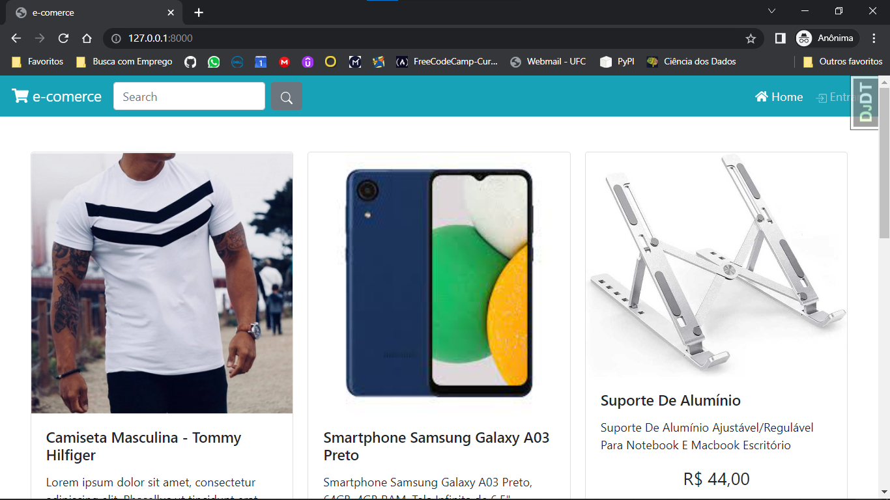

# Modelo de E-comerce_Django


## Apresentação

Este é um projeto voltado para estudo em Python e em seu framework para desenvolvimento Web, Django. É um projeto multidisciplinar na área de computação, em que pra desenvolvê-lo foi necessário desenvolver não só em Python mas também em HTML, CSS e até arranhar um pouco em JavaScript e Bootstrap. 
Como este projeto está sendo desenvolvido em single-core, ele ainda está bem no início em que muitas funcionalidades ainda estão em processo de desenvolvimento desenvolvimento. Então, qualquer ajuda e qualquer sugestão é bem vinda. 

## Ferramentas Utilizadas

Este projeto foi desenvolvido utilizando as seguintes ferramentas:

* Python 3.9
* Django 4.1
* Django-Crispy-Forms 1.4
* Pillow 9.2
* HTML
* CSS
* JavaScript
* Bootstrap
* SQLite3

## Rodando o Projeto na sua máquina

### Clonando o Repositório
Primeiramente você precisa fazer o clone do repositório utilizando o comando abaixo:

```
git clone https://github.com/leonhardc/e-comerce_Django.git
```

### Criando e instalando o ambiente virual
O projeto inteiro está sendo desenvolvido usando ambientes virtuais, se ainda não sabe ou não lembra como instalar um ambiente virtual python na sua máquina, basta executar o comando abaixo no seu terminal:

```
python -m venv venv
```

Depois de instalado, basta digitar `venv\Scrips\activate` no terminal do seu Windows, ou `source bin/activate` no linux.

### Instalando as dependencias do projeto

Depois que o projeto foi clonado e seu ambiente virtual está devidamente instalado e ativado, temos agora que instalar as dependencias do projeto, antes que possamos de fato, testá-lo:

Para instalar as dependencias do projeto, basta o comando abaixo no terminal:

```
pip install -r requirements.txt
```

### Executando e testando o projeto

Vamos lá, só mais um pouco para chegarmos onde queremos. Depois de todos os passos anteriores e lembrando, com o ambiente virtual ativado, só precisamos rodar o servidor nativo do django, para que ele cuide das nossas requisições e faça a aplicação, de fato, ser executada. 

Execute no seu terminal o comando para que possamos ativar o servidor django:

```
python manage.py runserver
```

Depois de alguns momentos, se todos os passos anteriores foram executados corretamente, podemos ver na tela do terminal algo como:


```
Watching for file changes with StatReloader
Performing system checks...

System check identified no issues (0 silenced).
September 27, 2022 - 20:54:37
Django version 4.1, using settings 'loja.settings'
Starting development server at http://127.0.0.1:8000/
Quit the server with CTRL-BREAK.
```

Se a mensagem acima foi exibida, então você pode acessar e ver a aplicação em execução digitando na barra de endereço do seu navegador o IP `http://127.0.0.1:8000/`


Como o projeto, a início não usa de base de dados mais robustas, fique a vontade para fazer seu cadastro, entrar entrar e bricar um pouco no pouco que já foi implementado.


## Um pouco da cara inicial do projeto

### Página Inicial

Abaixo é mostrado como o projeto se mostra inicialmente, com uma navbar simples com 4 elementos: a logo do projeto, um pequeno formulário de pesquisa de produtos (ainda não funcional), um botão para página principal do app e um botão entrar. Logo abaixo da navbar temos uma area direcionada para exibir os cards de todos os produtos cadastrados no banco de dados do nosso app.




## Referências

* [Documentação Django](https://docs.djangoproject.com/pt-br/4.1/)
* [Bootstrap](https://getbootstrap.com/)
* [Certificação de Web Design Responsivo - Free Code Camp](https://www.freecodecamp.org/learn/2022/responsive-web-design/)


